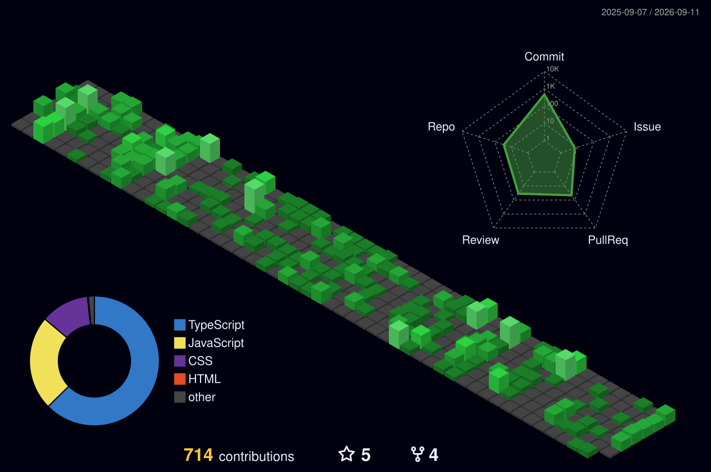

<div align="center">

  <!-- GIF -->
  

  <!-- Typing SVG -->
  [](https://git.io/typing-svg)

  <!-- Contact Badges -->
  <p>
    <a href="https://www.linkedin.com/in/dastan-hairushev-482848321/"></a>&nbsp;
    <a href="https://t.me/FierceSloth"></a>&nbsp;
    <a href="mailto:hairushevdastan@gmail.com"></a>
  </p>

  <!-- Profile Views -->
  
</div>

---

##  About Me

```ts
const dastan: Developer = {
  location: "Aktau, Kazakhstan 🇰🇿",
  age: 17,
  education: "RS School -- Stage 0 → Stage 3 (graduated)",
  role: "Frontend Developer",
  philosophy: "Build foundations first, frameworks second.",
  currentFocus: ["React ecosystem", "Next.js", "Full-stack development"],
  funFact: "None of my projects are tutorial clones -- every single one is built from scratch."
};
```

- 🎓 Выпускник **RS School** (полный курс: Vanilla JS → TypeScript → React/Next.js)
- 🏆 **2× Team Lead** в командных проектах, **2 из 3 наград** на RS Tandem Awards 2026 (среди 38 команд)
- 🧱 Начинал с **кастомного фреймворка на Vanilla TS** -- свой роутер, Event Bus, Component-класс -- и только потом перешёл к React
- 🔬 Пишу **strict TypeScript** -- 0 `any`, 0 `ts-ignore` во всех проектах
- 🌱 Сейчас изучаю: углубляюсь в full-stack

---

##  Tech Stack

<div align="center">

**Languages & Core**


**Frameworks & Libraries**


**Architecture & Concepts**


**Testing & Code Quality**


**Design & Management**


</div>

---

##  Featured Projects

<table>
  <tr>
    <td width="50%" valign="top">
      <h3>🏆 <a href="https://github.com/FierceSloth/rss-tandem-app">RS Tandem App</a></h3>
      <sub> </sub>
      <p>Интерактивная платформа для подготовки к техническим собеседованиям -- образовательные виджеты в формате мини-игр. Кастомный фреймворк на Vanilla TS (MVC, Component-класс, Event Bus), CodeMirror, Web Worker, Supabase.</p>
      <sub>
        
        
        
        
      </sub>
    </td>
    <td width="50%" valign="top">
      <h3>📐 <a href="https://github.com/FierceSloth/swagger-editor-app">Swagger / OpenAPI UI</a></h3>
      <sub> </sub>
      <p>Full-stack приложение для редактирования, валидации и тестирования REST API. CodeMirror + Spectral-линтинг, API Viewer, встроенный REST Client с серверным прокси, SSR-аналитика, Supabase Auth, i18n (EN/RU).</p>
      <sub>
        
        
        
        
      </sub>
    </td>
  </tr>
  <tr>
    <td width="50%" valign="top">
      <h3>🔍 <a href="https://github.com/FierceSloth/omni-search-dashboard">Omni Search Dashboard</a></h3>
      <sub> </sub>
      <p>Платформа поиска видеоигр (RAWG API), эволюционировавшая через 6 PR: Class Components → Hooks → Redux Toolkit → RTK Query → Next.js SSR + i18n. UI-кит из 15 компонентов, 0 any.</p>
      <sub>
        
        
        
        
      </sub>
    </td>
    <td width="50%" valign="top">
      <h3>📋 <a href="https://github.com/FierceSloth/react-advanced-forms">React Advanced Forms</a></h3>
      <sub> </sub>
      <p>Приложение регистрации с двумя подходами к формам: Uncontrolled Components и React Hook Form + zodResolver. Единая Zod-схема, Redux для истории, модальные окна на нативном &lt;dialog&gt; + React Portal.</p>
      <sub>
        
        
        
        
      </sub>
    </td>
  </tr>
  <tr>
    <td width="50%" valign="top">
      <h3>💬 <a href="https://github.com/FierceSloth/fun-chat">Fun Chat</a></h3>
      <sub> </sub>
      <p>SPA-мессенджер реального времени, полностью написанный с нуля. Кастомный WebSocket-сервис с авто-реконнектом и очередью, Event-Driven архитектура, статусы сообщений, Glassmorphism UI.</p>
      <sub>
        
        
        
        
      </sub>
    </td>
    <td width="50%" valign="top">
      <br>
      <div align="center">
        <i>...and <b>8 more projects</b> in my repositories 👀</i>
      </div>
    </td>
  </tr>
</table>

---

##  GitHub Stats

<p align="center">
  
  
</p>

<br>

<div align="center">
  
</div>

<div align="center">
  
</div>

---

<br>

<div align="center">
  <a href="https://github.com/ABSphreak/readme-jokes">
    
  </a>
</div>

---

<div align="center">
  
</div>
